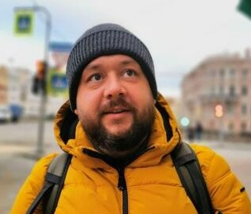

[Главная](./) *** [Биография](./bio.html) *** [Контакты](./links.html)

# Главная

Меня зовут Горбачёв Михаил. Я занимаюсь созданием и поддержкой IT:

- консультирую по созданию и развитию IT-инфраструктуры  
- решаю и подсказываю как решать возникшие ситуации
- объясняю простым языком сложные вещи

## Специализируюсь

Сети от офиса на несколько компьютеров до распределенных отказоустойчивых международных сетей.
Каналы L2/L3, VPN, IPsec, Wireguard, OpenVPN, DPI. 

Системы виртуализации: XEN, Proxmox, VmVare ESXi

Облачные провайдеры: AWS, Yandex.Cloud

Класическая и IP-телефония: Siemens, Panasonic, Avaya, Asterisk

CRM: amoCRM
 

## Навыки

- Программирование: Bash, Python, Kotlin
- Системы контроля версий и CI/DI: Github, gitlab

[back](./)